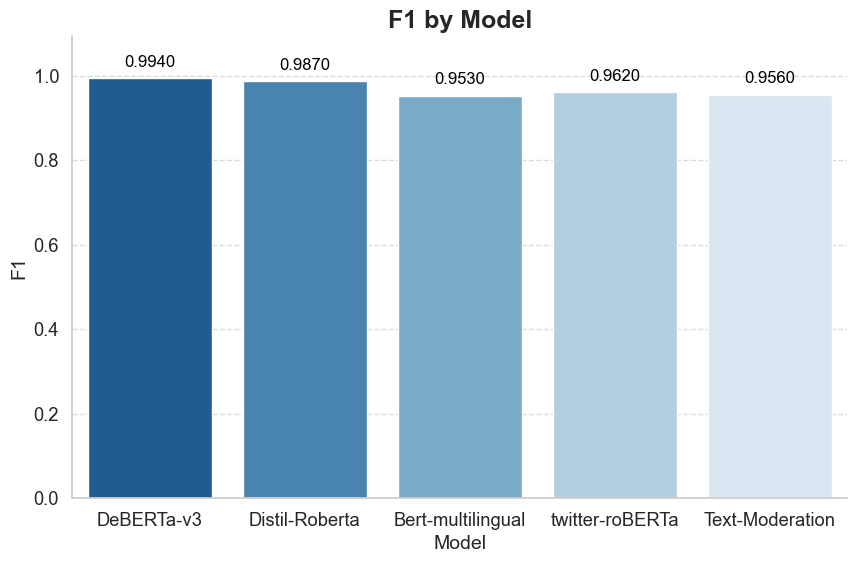
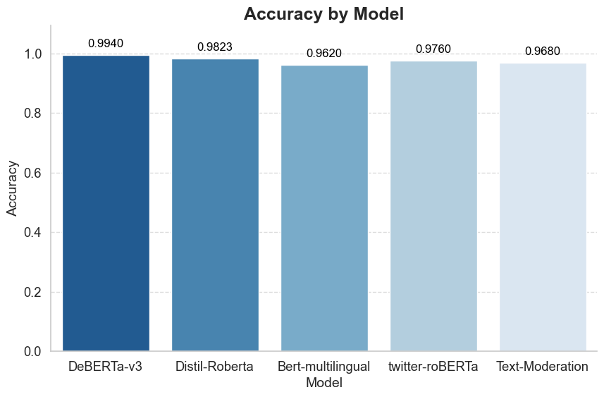
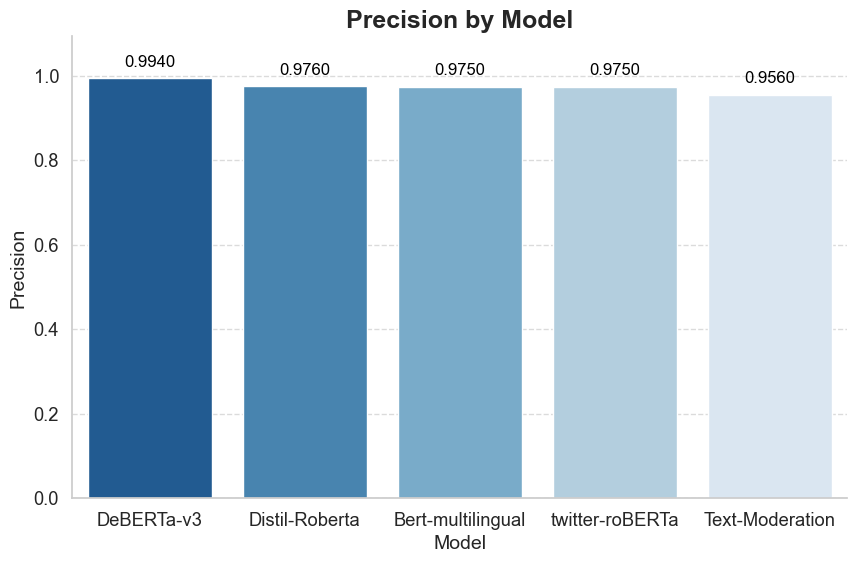
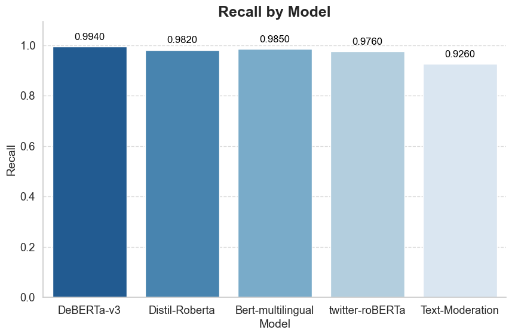
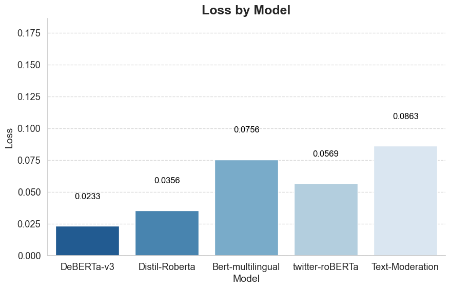
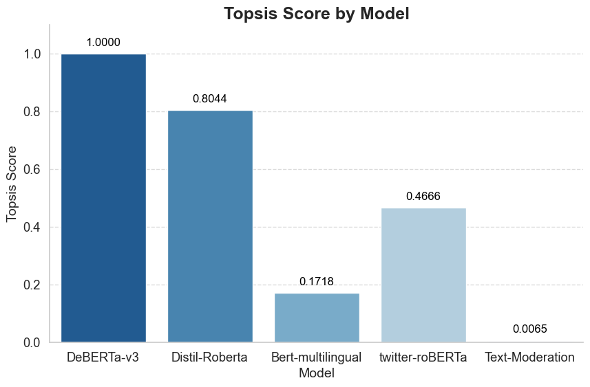
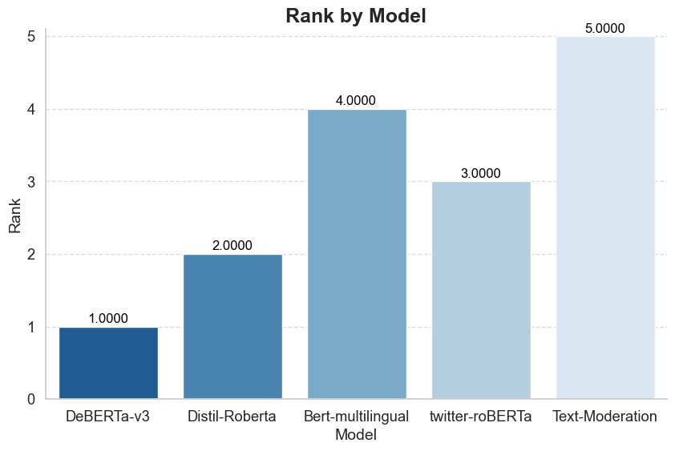

# Topsis on Pre-Trained Text Classification Models

The models are ranked based on their Topsis score

| Model             |    F1 |   Accuracy |   Precision |   Recall |    Loss |   Topsis Score |   Rank |
|:------------------|------:|-----------:|------------:|---------:|--------:|---------------:|-------:|
| DeBERTa-v3        | 0.994 |     0.994  |       0.994 |    0.994 | -0.0233 |     1          |      1 |
| Distil-Roberta    | 0.987 |     0.9823 |       0.976 |    0.982 | -0.0356 |     0.804449   |      2 |
| Bert-multilingual | 0.953 |     0.962  |       0.975 |    0.985 | -0.0756 |     0.17181    |      4 |
| twitter-roBERTa   | 0.962 |     0.976  |       0.975 |    0.976 | -0.0569 |     0.466571   |      3 |
| Text-Moderation   | 0.956 |     0.968  |       0.956 |    0.926 | -0.0863 |     0.00653414 |      5 |

## Performance Metrics

### F1 Score

### Accuracy

### Precision

### Recall

### Loss

### Topsis Score

### Rank

